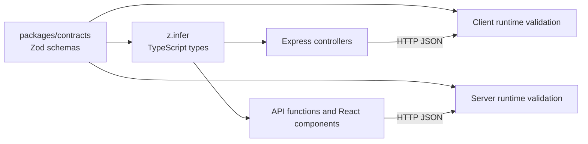

# Type-Safe Communication Between a Client and a Server

This repository is a small task manager that demonstrates a practical way to share an API contract between a React client and an Express server.

The minimal approach used here is:

1. Define request and response schemas once with [Zod](https://zod.dev/) in `packages/contracts`.
2. Infer TypeScript types from those schemas with `z.infer`.
3. Import the same schemas and types in both the server and the client.
4. Validate data at both network boundaries.

This is a REST API with shared Zod contracts. It does not require tRPC, code generation, or a database.

## Project Overview

```text
.
├── package.json                  # npm workspace and root development command
├── client/                       # React + Vite frontend
│   └── src/
│       ├── api/tasks.ts          # HTTP calls and response validation
│       ├── hooks/tasks.ts        # React Query integration
│       └── components/
├── server/                       # Express backend
│   └── src/
│       ├── index.ts              # Express application startup
│       ├── routes/tasks.ts       # HTTP route definitions
│       ├── controllers/tasks.ts  # Request handlers
│       ├── middlewares/validation.ts
│       └── data.ts               # In-memory task data
└── packages/contracts/           # Shared API schemas and inferred types
    └── src/tasks.ts
```

The server stores tasks in memory, so restarting it resets the data. The example focuses on the type boundary, not persistence.

## Prerequisites

- Node.js 20 or newer
- npm 10 or newer
- A terminal opened at the repository root

Check your versions:

```bash
node --version
npm --version
```

## Step 1: Create the Workspace

A workspace lets the client, server, and shared package live in one repository while remaining separate npm packages.

The root `package.json` contains:

```json
{
  "name": "task-app",
  "private": true,
  "type": "commonjs",
  "workspaces": [
    "client",
    "server",
    "packages/*"
  ],
  "scripts": {
    "dev": "concurrently --names client,server \"cd client && npm run dev\" \"cd server && npm run dev\""
  },
  "dependencies": {
    "concurrently": "^10.0.4"
  }
}
```

`private: true` prevents accidental publication of the workspace root. The `workspaces` array tells npm to install dependencies for all three packages and link `@task-app/contracts` locally.

Create the workspace from scratch:

```bash
mkdir type-safety-between-client-and-server
cd type-safety-between-client-and-server
npm init -y
npm install --save-dev concurrently
```

Then add the `workspaces` field and the root `dev` script shown above.

## Step 2: Create the Shared Contracts Package

Create the package:

```bash
mkdir -p packages/contracts/src
cd packages/contracts
npm init -y
npm install zod
```

Use this package manifest:

```json
{
  "name": "@task-app/contracts",
  "version": "1.0.0",
  "private": true,
  "type": "module",
  "main": "src/index.ts",
  "types": "src/index.ts",
  "dependencies": {
    "zod": "^4.4.3"
  }
}
```

The package name is important. Both applications can import from `@task-app/contracts` instead of reaching into each other's source folders.

### Define the schemas

Create `packages/contracts/src/tasks.ts`:

```ts
import { z } from "zod";

export const TaskSchema = z.object({
  id: z.number(),
  title: z.string().min(1, "Title cannot be empty"),
  completed: z.boolean(),
});

export const CreateTaskSchema = TaskSchema.omit({
  id: true,
  completed: true,
});

export const DeleteTaskSchema = z.object({
  id: z.coerce.number(),
});

export const TaskResponseSchema = z.array(TaskSchema);
export const CreateTaskResponseSchema = TaskSchema;
export const DeleteTaskResponseSchema = z.object({
  success: z.literal(true),
});
```

A schema does two jobs:

- It is executable JavaScript that can validate untrusted JSON at runtime.
- It describes a TypeScript type that can be inferred at compile time.

Export the inferred types from the same file:

```ts
export type Task = z.infer<typeof TaskSchema>;
export type CreateTaskInput = z.infer<typeof CreateTaskSchema>;
export type DeleteTaskInput = z.infer<typeof DeleteTaskSchema>;
export type TaskResponse = z.infer<typeof TaskResponseSchema>;
export type CreateTaskResponse = z.infer<typeof CreateTaskResponseSchema>;
export type DeleteTaskResponse = z.infer<typeof DeleteTaskResponseSchema>;
```

`CreateTaskSchema` is derived from `TaskSchema`, so a create request cannot accidentally require server-generated fields such as `id` or `completed`.

Create `packages/contracts/src/index.ts` as the public entry point:

```ts
export {
  TaskSchema,
  CreateTaskSchema,
  DeleteTaskSchema,
  TaskResponseSchema,
  CreateTaskResponseSchema,
  DeleteTaskResponseSchema,
} from "./tasks.ts";

export type {
  Task,
  CreateTaskInput,
  DeleteTaskInput,
  TaskResponse,
  CreateTaskResponse,
  DeleteTaskResponse,
} from "./tasks.ts";
```

The separate `export type` block works with `verbatimModuleSyntax` and makes it clear which exports exist only for TypeScript.

## Step 3: Configure TypeScript

The client and server each have their own TypeScript configuration because they have different runtimes.

The client uses browser libraries and Vite:

```json
{
  "compilerOptions": {
    "target": "es2023",
    "lib": ["ES2023", "DOM"],
    "module": "esnext",
    "moduleResolution": "bundler",
    "allowImportingTsExtensions": true,
    "verbatimModuleSyntax": true,
    "noEmit": true,
    "jsx": "react-jsx",
    "strict": true,
    "noUnusedLocals": true,
    "noUnusedParameters": true
  },
  "include": ["src"]
}
```

The server uses Node's ESM resolution and emits JavaScript for production:

```json
{
  "compilerOptions": {
    "target": "esnext",
    "module": "NodeNext",
    "rewriteRelativeImportExtensions": true,
    "allowImportingTsExtensions": true,
    "verbatimModuleSyntax": true,
    "strict": true,
    "types": ["node"]
  }
}
```

The shared package is imported as a workspace dependency:

```json
{
  "dependencies": {
    "@task-app/contracts": "^1.0.0"
  }
}
```

After adding all package manifests, install from the root:

```bash
npm install
```

Do not install the contracts package from a registry. npm workspaces link the local package automatically.

## Step 4: Build the Server

Install the server dependencies:

```bash
cd server
npm install express cors
npm install --save-dev typescript tsx @types/node @types/express @types/cors
```

Create `server/src/data.ts`:

```ts
import type { Task } from "@task-app/contracts";

export const tasks: Task[] = [
  { id: 1, title: "Learn TypeScript", completed: false },
  { id: 2, title: "Build Task Manager", completed: false },
];
```

The annotation means seed data must satisfy the shared `Task` type.

### Add validation middleware

Create `server/src/middlewares/validation.ts`:

```ts
import type { Request, Response, NextFunction } from "express";
import { type ZodType, ZodError } from "zod";

export const validateBody = (schema: ZodType) => {
  return (req: Request, res: Response, next: NextFunction) => {
    try {
      req.body = schema.parse(req.body);
      next();
    } catch (error) {
      if (error instanceof ZodError) {
        return res.status(400).json({
          error: "Validation failed",
          details: error.issues.map((issue) => ({
            field: issue.path.join("."),
            message: issue.message,
          })),
        });
      }
      next(error);
    }
  };
};
```

The browser can send arbitrary JSON, so TypeScript alone cannot protect the server. `schema.parse` is the runtime boundary check. Invalid data never reaches the controller.

The repository uses the same pattern for route parameters with `validateParams(DeleteTaskSchema)`.

### Add routes and controllers

Create `server/src/routes/tasks.ts`:

```ts
import { Router } from "express";
import { CreateTaskSchema, DeleteTaskSchema } from "@task-app/contracts";
import { getAllTasks, createTask, deleteTask } from "../controllers/tasks.ts";
import { validateBody, validateParams } from "../middlewares/validation.ts";

const router = Router();

router.get("/", getAllTasks);
router.post("/", validateBody(CreateTaskSchema), createTask);
router.delete("/:id", validateParams(DeleteTaskSchema), deleteTask);

export default router;
```

Create `server/src/controllers/tasks.ts`:

```ts
import type { Request, Response } from "express";
import type { Task } from "@task-app/contracts";
import { tasks } from "../data.ts";

export const getAllTasks = (_req: Request, res: Response) => {
  res.json(tasks);
};

export const createTask = (req: Request, res: Response) => {
  const { title } = req.body;
  const newTask: Task = {
    id: Date.now(),
    title,
    completed: false,
  };
  tasks.push(newTask);
  res.status(201).json(newTask);
};

export const deleteTask = (req: Request, res: Response) => {
  const id = Number(req.params.id);
  const taskIndex = tasks.findIndex((task) => task.id === id);

  if (taskIndex === -1) {
    res.status(404).json({ error: "Task not found" });
    return;
  }

  tasks.splice(taskIndex, 1);
  res.status(200).json({ success: true });
};
```

`Task` catches mistakes while writing the response object, but response validation is still useful because a future code change could return the wrong shape. The current example validates responses on the client.

Create `server/src/index.ts`:

```ts
import cors from "cors";
import express from "express";
import taskRouter from "./routes/tasks.ts";

const app = express();
const port = 3000;

app.use(cors());
app.use(express.json());
app.use("/api/tasks", taskRouter);

app.listen(port, () => {
  console.log(`Server is running on port ${port}`);
});
```

The resulting endpoints are:

| Method | URL | Input | Success response |
| --- | --- | --- | --- |
| `GET` | `/api/tasks` | none | `Task[]` |
| `POST` | `/api/tasks` | `{ "title": "..." }` | `Task` |
| `DELETE` | `/api/tasks/:id` | numeric route parameter | `{ "success": true }` |

## Step 5: Build the Client

Install the client dependencies:

```bash
cd client
npm install react react-dom axios @tanstack/react-query @tanstack/react-query-devtools
npm install --save-dev typescript vite @vitejs/plugin-react @types/react @types/react-dom
```

### Add the typed API client

Create `client/src/api/tasks.ts`:

```ts
import axios from "axios";
import {
  CreateTaskSchema,
  CreateTaskResponseSchema,
  DeleteTaskResponseSchema,
  TaskResponseSchema,
} from "@task-app/contracts";
import type {
  CreateTaskResponse,
  DeleteTaskResponse,
  TaskResponse,
} from "@task-app/contracts";

const apiUrl = "http://localhost:3000/api/tasks";

export const getTasks = async (): Promise<TaskResponse> => {
  const response = await axios.get(apiUrl);
  return TaskResponseSchema.parse(response.data);
};

export const addTask = async (title: string): Promise<CreateTaskResponse> => {
  const body = CreateTaskSchema.parse({ title });
  const response = await axios.post(apiUrl, body);
  return CreateTaskResponseSchema.parse(response.data);
};

export const deleteTask = async (id: number): Promise<DeleteTaskResponse> => {
  const response = await axios.delete(`${apiUrl}/${id}`);
  return DeleteTaskResponseSchema.parse(response.data);
};
```

There are two important checks here:

- `CreateTaskSchema.parse` checks the outgoing request before it leaves the browser.
- The response schemas check data received over HTTP before it is treated as a `Task`.

Axios itself does not make JSON type-safe. The explicit Zod parse is what turns unknown network data into validated data.

### Connect React Query

Create `client/src/hooks/tasks.ts`:

```ts
import { useMutation, useQuery, useQueryClient } from "@tanstack/react-query";
import type { Task } from "@task-app/contracts";
import { addTask, deleteTask, getTasks } from "../api/tasks.ts";

export const useGetTasks = () => {
  return useQuery<Task[]>({
    queryKey: ["tasks"],
    queryFn: getTasks,
  });
};

export const useDeleteTask = () => {
  const queryClient = useQueryClient();

  return useMutation({
    mutationFn: (id: number) => deleteTask(id),
    onSuccess: () => {
      queryClient.invalidateQueries({ queryKey: ["tasks"] });
    },
  });
};

export const useAddTask = () => {
  const queryClient = useQueryClient();

  return useMutation({
    mutationFn: (title: string) => addTask(title),
    onSuccess: () => {
      queryClient.invalidateQueries({ queryKey: ["tasks"] });
    },
  });
};
```

`getTasks` returns `Promise<TaskResponse>`, and `TaskResponse` is inferred from `TaskResponseSchema`. React Query therefore exposes data whose compile-time shape is `Task[]`, after runtime validation has succeeded.

A component can now use the contract type without defining a duplicate interface:

```tsx
import type { Task } from "@task-app/contracts";

interface TaskListProps {
  readonly tasks: Task[];
  readonly onDelete: (id: number) => void;
}

export default function TaskList({ tasks, onDelete }: TaskListProps) {
  return (
    <div>
      {tasks.map((task) => (
        <div key={task.id}>
          <span>{task.title}</span>
          <button type="button" onClick={() => onDelete(task.id)}>
            Delete
          </button>
        </div>
      ))}
    </div>
  );
}
```

The application entry point provides React Query:

```tsx
const queryClient = new QueryClient();

createRoot(document.getElementById("root")!).render(
  <QueryClientProvider client={queryClient}>
    <App />
  </QueryClientProvider>,
);
```

## Step 6: Run the Example

From the repository root:

```bash
npm install
npm run dev
```

This starts:

- Vite at `http://localhost:5173`
- Express at `http://localhost:3000`

Open `http://localhost:5173` in a browser. You can also call the API directly:

```bash
curl http://localhost:3000/api/tasks
curl -X POST http://localhost:3000/api/tasks \
  -H "Content-Type: application/json" \
  -d '{"title":"Read the contracts"}'
curl -X DELETE http://localhost:3000/api/tasks/1
```

Try sending an invalid request:

```bash
curl -X POST http://localhost:3000/api/tasks \
  -H "Content-Type: application/json" \
  -d '{"title":""}'
```

The server returns `400` because `CreateTaskSchema` requires a non-empty title.

## How Type Safety Flows



The full request flow for creating a task is:

1. A React form produces a `string` title.
2. `addTask` builds `{ title }` and parses it with `CreateTaskSchema`.
3. Axios sends the validated JSON to `POST /api/tasks`.
4. Express runs `validateBody(CreateTaskSchema)` before the controller.
5. The controller creates a `Task`, whose object is checked by TypeScript.
6. The client parses the response with `CreateTaskResponseSchema`.
7. The returned `Task` is available to React Query and components with the inferred type.

Compile-time types prevent mistakes while writing code. Runtime schemas protect the actual network boundary. You need both because TypeScript types disappear when JavaScript runs.

## Why This Is the Minimal Approach

REST plus shared Zod is a good starting point when:

- The API should remain understandable with normal HTTP tools.
- The client and server are in the same monorepo.
- You want runtime validation without introducing a code generator.
- You only need a small number of endpoints.

`tRPC` is another option. It can infer client procedure types directly from server routers, but it couples the client more closely to the server framework. For a small REST API, one shared contracts package is easier to inspect and debug.

## Best Practices

- Keep schemas in one package that neither application owns.
- Infer types from schemas instead of maintaining duplicate interfaces.
- Validate request bodies, route parameters, query parameters, and responses.
- Treat Axios or `fetch` responses as untrusted until parsed.
- Use `TaskSchema.omit`, `pick`, and `extend` to derive related contracts.
- Keep HTTP transport code in an API module, not inside React components.
- Use environment variables for the API base URL outside this local example.
- Give success and error responses documented, stable shapes.
- Add contract tests for invalid input and representative valid responses.
- Keep server and client builds strict so missing fields and incorrect types fail early.

## Pitfalls to Avoid

- **Types are not runtime validation.** A type assertion such as `response.data as Task[]` checks nothing at runtime.
- **Duplicated interfaces drift.** A client-side `Task` interface can silently become different from the server model.
- **Validation only on the client is insufficient.** Other clients can call the API directly.
- **Validation only on the server leaves the client boundary unchecked.** A backend regression can feed malformed data into the UI.
- **Do not expose database models as API contracts automatically.** API input and output often have different fields and security rules.
- **Do not use `any` for `req.body`.** Validate it and then narrow the value, or add typed Express request helpers as the application grows.
- **Do not forget runtime coercion.** URL parameters arrive as strings; `DeleteTaskSchema` uses `z.coerce.number()` for that reason.
- **Avoid importing files through relative paths across packages.** Import the public package entry point so the boundary remains clear.
- **Watch workspace build boundaries.** If a package is compiled separately, give it its own build output and make dependent packages build after it.

## Useful Commands

```bash
# Start client and server together
npm run dev

# Build the client
npm run build --workspace client

# Type-check the server configuration
npx tsc -p server/tsconfig.json --noEmit

# Run client linting
npm run lint --workspace client
```

The client production build is currently verified with `npm run build --workspace client`. The server's current `tsconfig.build.json` emits from `server/src` while TypeScript resolves the local contracts source, so a production server build needs a separate compiled contracts output or a project-reference setup. The development command remains the intended example workflow here because `tsx` can execute the TypeScript workspace source directly.

## Next Improvements

For a production-ready version, the next small improvements would be:

1. Add a contracts `tsconfig.json` that emits declarations and JavaScript to `packages/contracts/dist`.
2. Point the package `main` and `types` fields at that build output.
3. Build contracts before the server and client.
4. Add tests that parse successful and failed request/response examples.
5. Move `http://localhost:3000` into a Vite environment variable.
6. Replace the in-memory array with a database repository.
